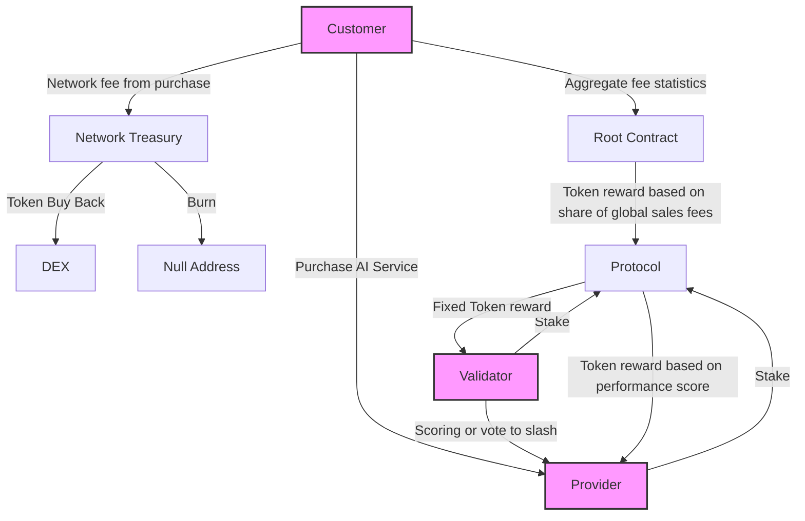

> Forest AI came from the question: "What if the 175 Terra Watt hours going to BitCoin mining was used for AI innovation?"

## Network Actors 

**Customers:** Purchase AI services and influence token rewards. The protocols and providers with most customers get the most token emissions.

**Providers:** Compete to offer the best AI services within a protocol and earn tokens based on performance. 

**Validators:** Evaluate providers' performance and ensuring cross-compatibility

**Protocols**: Standardize competition over an AI task. Define API standards for providers and quality evaluation criteria for validators.

**Protocol Admin:** Defines protocol goal and hyperparameters.

**Root Contract:**  Smart contract that creates and distributes tokens to protocols based on their customer revenue.
 

## Token flow 

# Motivation

## Mining rewards that follow the market

Blockchain mining rewards have been rigid historically. Forest AI is introducing a robust system of diverse mining rewards that adjust with the market.  

**1st Gen:** Bitcoin mining is just a competition for who can randomly guess the right numbers to hash together and hence seen as a significant waste of energy. 

**2nd Gen:** Projects like [LivePeer](https://github.com/livepeer/wiki/blob/master/WHITEPAPER.md), [FileCoin](https://filecoin.io/filecoin.pdf) or [Render Network](https://renderfoundation.com/whitepaper) that give mining rewards for workloads that have real world utility, but they define that utility in a narrow way with rigid smart contracts making it hard for the networks to adapt to a changing market. 

**3rd Gen:** Forest AI’s mining rewards are dynamically adjusted to reward mining workloads that have the most utility to the market. Any workload that can be framed as an AI Agent can be proposed and minded in a permissionless manner.

## Deterministic innovation funding  
Since the majority of mining rewards go to providers who are typically AI startups one could consider the network a form of startup funding. 
The network invests in innovative AI startups and can collect a return on this investment from the cumulative future customer fees and increased demand for the network token. Token reward are directly linked to new customer revenue coming into the network and validators further direct the rewards to the most innovative providers with the best AI. 

Traditional venture capital (VC) funding entrusted a lump sum of money to a group of people that have gone through an extensive but subjective vetting process. The overhead of traditional funding decision-making is huge not only on the VC side but also on the side of the startup. Founders must dedicate huge amounts of time to outreach, networking events and relationship building to get invited to a VC meeting, and they may need hundreds of such meetings over the course of months as each has <1% probability of success. And once a funding decision has been made it is followed by even more overhead with legal contracting. 

The Forest AI smart contracts can make funding decisions deterministically leaning on the self-motivated signals coming from customers and validators. Funding requires no political connections or networking. An AI PhD student living in a smaller country without a significant VC network can simply register their model to a protocol where they know it will win the highest scores, and they will immediately get funding to further its development. 

## Addressing Industry Wide Overfitting
 

Public benchmark test data sets make AI model performance comparable.  But this creates an incentivization for closed source models in particular to game the benchmarks by creating heuristics for them or overfitting their training data to include solutions to the known testsets.

For open source models [Dynabench](https://arxiv.org/abs/2104.14337) attempts to solve the problem of overfitting on test datasets with a community of humans intentionally creating new test data designed to be hard for models. But the Dynabench only works with open source models. Additionally, Dynabench has not seen significant adoption even after being managed by mlCommons, we believe this lack of traction is due to a lack of incentives for evaluators or AI model owners to participate. Forest Protocols’ aims to properly incentivize both AI model owners and those that evaluate them for sustainable long term adoption. 

Centralized private test data evaluation is another approach that has been attempted to resolve the problem of AI companies gaming benchmark results. One currently active private evaluator is the [SEAL](https://scale.com/leaderboard) LLM Leaderboards by Safety, Evaluations, and Alignment Lab (SEAL) at Scale.ai.  Private test sets are a fundamental part of the strategy at Forest Protocols but one individual centralized evaluator must be trusted to not be paid off to favor one AI model company over another.  Forest protocol enhances resilience by requiring all subnets to have multiple independent validators each of which having economic collateral that can get slashed if a public audit of their votes and test data reveals that they were clearly biased towards one model.  
Current private validators like SEAL could become part of the Forest Protocols network if they are willing to put collateral behind the trust in their fair evaluations. 

Forest AI combines the approaches of SEAL and Dynabench adding corruption resistance and a funding mechanism for the continuous creation of new private test data by multiple independent parties.  
