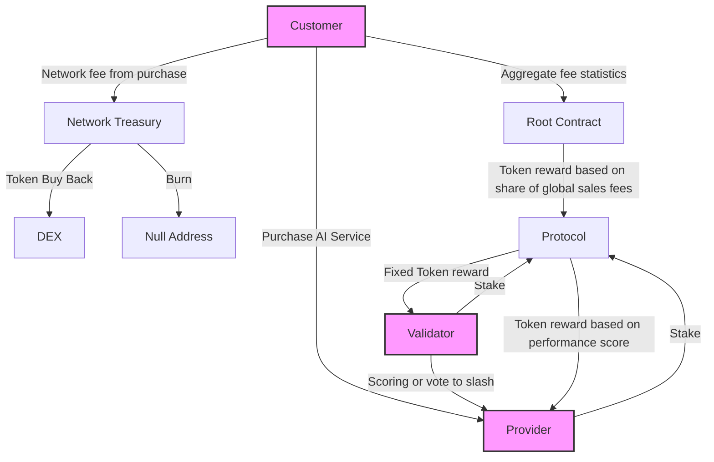

**Customers:** Purchase AI services and influence token rewards. The protocols and providers with most customers get the most token emissions.

**Providers:** Compete to offer the best AI services within a protocol and earn tokens based on performance. 

**Validators:** Evaluate providers' performance and ensuring cross-compatibility

**Protocols**: Standardize competition over an AI task. Define API standards for providers and quality evaluation criteria for validators.

**Protocol Admin:** Defines protocol goal and hyperparameters.

**Root Contract:**  Smart contract that creates and distributes tokens to protocols based on their customer revenue.
 

