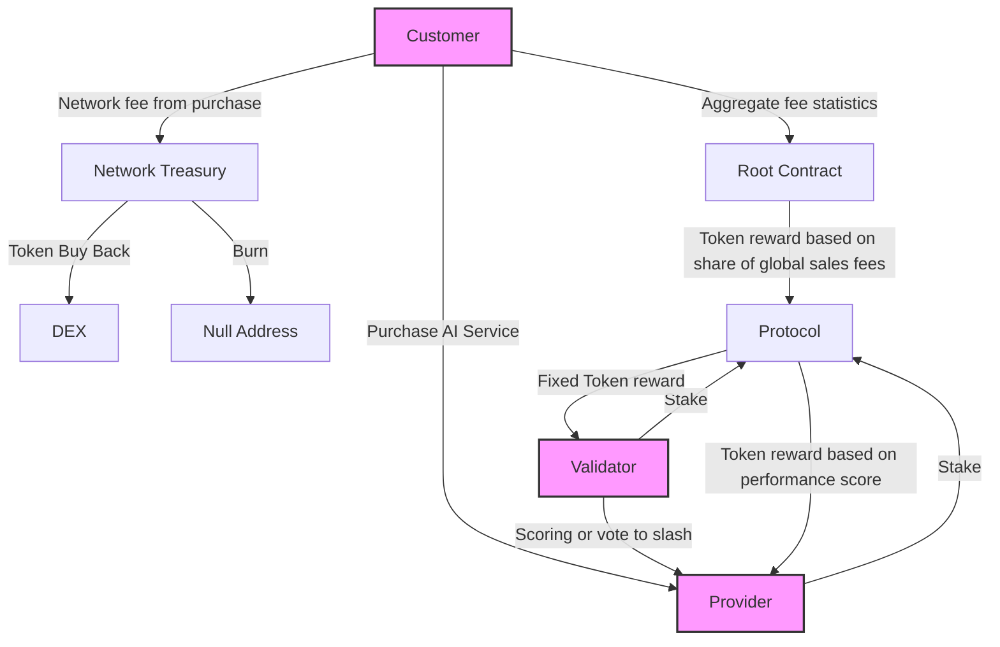

> Forest AI came from the question: "What if the 175 Terra Watt hours going to BitCoin mining was used for AI innovation?"

## Network Actors 

**Customers:** Purchase AI services and influence token rewards. The protocols and providers with most customers get the most token emissions.

**Providers:** Compete to offer the best AI services within a protocol and earn tokens based on performance. 

**Validators:** Evaluate providers' performance and ensuring cross-compatibility

**Protocols**: Standardize competition over an AI task. Define API standards for providers and quality evaluation criteria for validators.

**Protocol Admin:** Defines protocol goal and hyperparameters.

**Root Contract:**  Smart contract that creates and distributes tokens to protocols based on their customer revenue.
 

## Token flow 

## Token Emissions 

1. Each epoch 1000 tokens are generated 

2. Each Protocol gets tokens proportional to its share of Sales Fees
3. Each Provider in a protocol gets tokens proportionally to AI performance score

Above example is simplified for illistrative purposes. Protocol administrators can define how exactly tokens are distributed over all participants : Validators, Providers and Admins. For exact details see /contracts directory. 

## Validation 

Every Epoch inside each protocol the participating validators score performance of all participating providers.  The scoring process is as follows. 

1. Validators generate new test data locally and keep them secret 
2. At any random time  within the epoch validators purchase services from each provider  and send test prompts
3. Providers immediately reply with a signed response to each prompt  
4. Validators score each response relative to other participating proiders
5. During Voting Window  Validators hash their score vector and submit it on-chain 
6. When Reveal Window is opened: Validators reveal raw scores for each of the tests they have performed

# Motivation

## Mining rewards that follow the market

Blockchain mining rewards have been rigid historically. Forest AI is introducing a robust system of diverse mining rewards that adjust with the market.  

**1st Gen:** Bitcoin mining is just a competition for who can randomly guess the right numbers to hash together and hence seen as a significant waste of energy. 

**2nd Gen:** Projects like [LivePeer](https://github.com/livepeer/wiki/blob/master/WHITEPAPER.md), [FileCoin](https://filecoin.io/filecoin.pdf) or [Render Network](https://renderfoundation.com/whitepaper) that give mining rewards for workloads that have real world utility, but they define that utility in a narrow way with rigid smart contracts making it hard for the networks to adapt to a changing market. 

**3rd Gen:** Forest AI’s mining rewards are dynamically adjusted to reward mining workloads that have the most utility to the market. Any workload that can be framed as an AI Agent can be proposed and minded in a permissionless manner.

## Deterministic innovation funding  
Since the majority of mining rewards go to providers who are typically AI startups one could consider the network a form of startup funding. 
The network invests in innovative AI startups and can collect a return on this investment from the cumulative future customer fees and increased demand for the network token. Token reward are directly linked to new customer revenue coming into the network and validators further direct the rewards to the most innovative providers with the best AI. 

Traditional venture capital (VC) funding entrusted a lump sum of money to a group of people that have gone through an extensive but subjective vetting process. The overhead of traditional funding decision-making is huge not only on the VC side but also on the side of the startup. Founders must dedicate huge amounts of time to outreach, networking events and relationship building to get invited to a VC meeting, and they may need hundreds of such meetings over the course of months as each has <1% probability of success. And once a funding decision has been made it is followed by even more overhead with legal contracting. 

The Forest AI smart contracts can make funding decisions deterministically leaning on the self-motivated signals coming from customers and validators. Funding requires no political connections or networking. An AI PhD student living in a smaller country without a significant VC network can simply register their model to a protocol where they know it will win the highest scores, and they will immediately get funding to further its development. 

## Addressing Industry Wide Overfitting
 

Public benchmark test data sets make AI model performance comparable.  But this creates an incentivization for closed source models in particular to game the benchmarks by creating heuristics for them or overfitting their training data to include solutions to the known testsets.

For open source models [Dynabench](https://arxiv.org/abs/2104.14337) attempts to solve the problem of overfitting on test datasets with a community of humans intentionally creating new test data designed to be hard for models. But the Dynabench only works with open source models. Additionally, Dynabench has not seen significant adoption even after being managed by mlCommons, we believe this lack of traction is due to a lack of incentives for evaluators or AI model owners to participate. Forest Protocols’ aims to properly incentivize both AI model owners and those that evaluate them for sustainable long term adoption. 

Centralized private test data evaluation is another approach that has been attempted to resolve the problem of AI companies gaming benchmark results. One currently active private evaluator is the [SEAL](https://scale.com/leaderboard) LLM Leaderboards by Safety, Evaluations, and Alignment Lab (SEAL) at Scale.ai.  Private test sets are a fundamental part of the strategy at Forest Protocols but one individual centralized evaluator must be trusted to not be paid off to favor one AI model company over another.  Forest protocol enhances resilience by requiring all subnets to have multiple independent validators each of which having economic collateral that can get slashed if a public audit of their votes and test data reveals that they were clearly biased towards one model.  
Current private validators like SEAL could become part of the Forest Protocols network if they are willing to put collateral behind the trust in their fair evaluations. 

Forest AI combines the approaches of SEAL and Dynabench adding corruption resistance and a funding mechanism for the continuous creation of new private test data by multiple independent parties.  

# Use Cases

### Machine Translation [Text to Text ]:  
A text to text problem with multiple correct answers such as translating from English to Korean.  Validators will create specialized test datasets with one English prompt  and 3-5 correct reference translations.  When validators get translated answers from each of the participating miners they will score them based on how close they are to the reference translations using the [BLEU](https://aclanthology.org/P02-1040.pdf) scoring method.  
	

### Python Code Generation [Text To Text]:   
This subnet would be the continually evaluated alternative to current standards in academia like MBPP  PAPER     https://paperswithcode.com/sota/code-generation-on-mbpp   https://huggingface.co/datasets/google-research-datasets/mbpp     or APPS https://datasets-benchmarks-proceedings.neurips.cc/paper/2021/file/c24cd76e1ce41366a4bbe8a49b02a028-Paper-round2.pdf    or HumanEval https://arxiv.org/abs/2107.03374 https://huggingface.co/datasets/openai/openai_humaneval . The current standards have known questions and hence particularly closed source models can pretrain on this test data to overfit their results making the models seem superior while they only overfit this specific testset. 
Validators in a Text To Code subnet would independently generate their own coding challenges with test cases on how to check for correctness (in python for instance).  The text prompts are sent to the miners (aka AI model providers) whom must return functioning code that is the executed by the validator to check for correctness and CPU efficiency of the solution. While validators might 

### Image Generation [ Text to Image]: 
While being one of the most common everyday  uses of AI it is also one of the hardest to define a scoring standard for due to the subjectivity of what is the most accurate or most beautiful image.  Here it is important to note that the validators have two scoring mechanism,  one is a boolean vote if the miner(aka AI model provider)  is in compliance with the basic requirements  such as responding promptly with an image, abiding by the defined API  and producing an image which on a very basic level can be considered to depict most of the text prompt.The validators output a scaler value which is designed as a relative score against the other answers provided. In the case of text to image it will be easy for users themselves to test multiple providers since the queries are standardized over all the providers a user can directly ask for the same prompt from all providers (aided by the user interface) and after a few prompts choosing only their favorite providers for the remaining prompts or let the validator ranking guide their choice by default. As previously stated the protocol values users' purchasing decisions higher than validator votes themselves and in the case of text to image this alleviates the issue of ambiguity of evaluation  by the wisdom of the crowd. 

### Future Event Prediction  [ Text to Boolean ]: 
 Future events prediction has utility in many industries such as insurance, finance, energy markets among others. Each of these specialized prediction markets could become their own subnets. Real world events suit themselves particularly well for decentralized validation as there is little ambiguity of scoring results once the event has happened or time has passed before which the event should have happened.  Each validator independently defines events to be predicted such as will the price of bitcoin be above $100,000 within the next 7 days, OPEC announced a reduction in oil production within the next 30days or will the US Federal Reserve increase interest rates next month.  All events have a boolean outcome with in a specific date and each miner will announce their predictions to each validator who can then score them with accuracy 0 or 1 and average over all event questions. 
