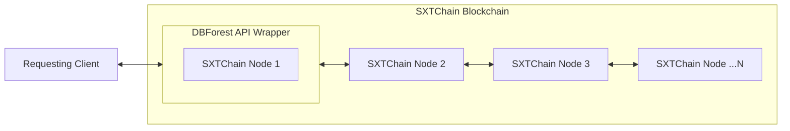
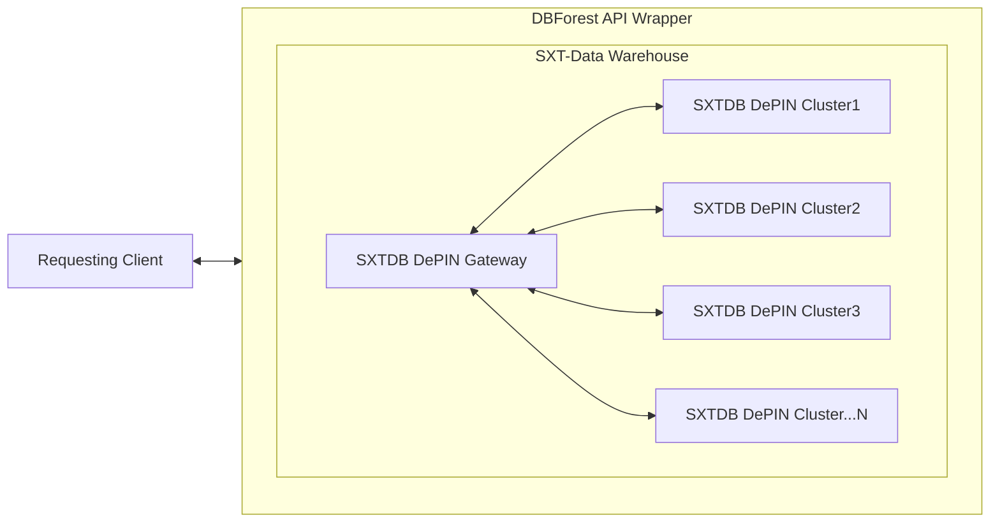

# Space And Time

## Goal

The goal of this subnet is to provide incentivizing fast SQL query execution on public datasets that are kept always up to date, including the Space And Time schemas for blockchain data. It is expected that most participants will directly run SXTChain nodes and compete on query performance, but it is also possible to use alternative backend technologies, provided they adhere to the same schemas.

## Evaluation

Validators assess the accuracy of SQL computation results, data freshness, and speed to respond. Validators are expected to know the current updated state of all accessible datasets to ensure they can test correctness of data returned. Validators will randomly register as customers and query all providers with the same sqlText to get direct comparison ability.

## Platform Choice

There are two options when connecting to the SXT Environment: query individual, participating SXTChain Node providers, who represent a specific data set (say, Ethereum, or zkSync, or Bitcoin, etc.), OR, connect to the SXT Data Warehouse DePIN gateway, which provides a single unified view of ALL SXTChain data data, however may be a second or two behind the SXTChain data, and as a permissioned DePIN requires special access and setup. 

 

## SXTChain

Currently the SXTChain is in Testnet, with expected Mainnet in April of 2025.  This is future-facing until the nodes are available on mainnet.

 
### Actions
(Are these endpoints? - I wrote them as if they were)

####  POST `/sql`
  - `sqlText` (_string_, required): The full SQL text to execute
    - The SQL text must be less than 10,000 characters.
    - The SQL text must be a valid SQL statement.
    - The SQL text must not contain any UPDATE, INSERT or DELETE statements
  - `walletAddress` (_string_, required): The SXTChain (ECDSA) wallet 
    - used to validate the signedSqlText and pay for gas.
  - `signedSqlText` (_string_, required): the signed sqlText, signed by the user's wallet.  Must be verifiable by the walletAddress and match exactly the sqlText.
  
    **RETURNS**: data output from sqlText, as JSON

 

## SXT Data Warehouse:

Currently available in full, however permissioned network with limited operators.

### Actions

####  POST `/sql`
  - `sqlText` (_string_, required): The full SQL text to execute
    - The SQL text must be less than 10,000 characters.
    - The SQL text must be a valid SQL statement.
    - The SQL text must not contain any UPDATE, INSERT or DELETE statements
  - `apiKey` (_string_, required): the user's Space and Time DWH API Key. For instructions on how to generate, see: https://docs.spaceandtime.io/docs/api-keys 
  
    **RETURNS**: data output from sqlText, as JSON

  

## Performance Requirements

- **Response Times**:

  - Simple `SELECT * FROM SXTLabs.Calendar Limit 1;` statements must return within 2Second

## Constraints

- **SQL Text**:
  - The SQL text must be less than 10,000 characters.
  - The SQL text must be a valid SQL statement.
  - The SQL text must not contain any UPDATE, INSERT or DELETE statements, except for certain defined tables. 
